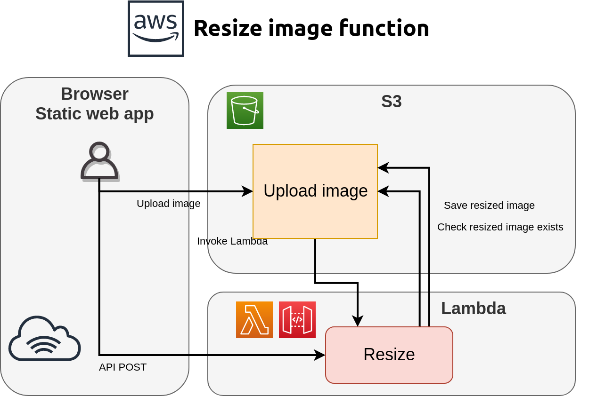

# AWS Resize

[](http://spiceprogram.org/oss-sponsorship)

Resizes S3 stored image using NodeJS [sharp](https://github.com/lovell/sharp) library



  * Typescript
  * Unit and e2e tests
  * Configuration
  * Deployment using [Serverless framework](https://serverless.com)
  * Connect to API Gateway and existing S3 bucket
  * Payload testing using [io-ts](https://github.com/gcanti/io-ts)

## Settings and private keys management

This project uses [chamber CLI](https://github.com/segmentio/chamber) tool to manage project 
settings and private values. 

Variables are stored in [AWS Parameter Store](https://docs.aws.amazon.com/systems-manager/latest/userguide/systems-manager-parameter-store.html) with specified prefix.

To read more about chamber, take a look at my article [Using AWS and segment.io/chamber CLI for managing secrets for your projects](https://medium.com/@ruslanfg/using-segment-io-chamber-for-managing-secrets-for-your-hobby-projects-2e08faaee5e2)

## Installing

  * Create AWS S3 bucket
  * Install [Chamber CLI](https://github.com/segmentio/chamber/wiki/Installation)
  * `> yarn`
  * `> yarn lint && yarn format && yarn build`

## Testing

This project have unit tests and end-to-end tests integrated. Variables and AWS settings to 
run E2E tests are taken from environment and from AWS Parameter Store.

### Run unit tests

Execute `yarn mocha` to run all tests from `./test` directory.

### Run end-to-end tests

Copy files in `./test-assets/` folder to the S3 bucket of your choice.
Define parameters in AWS Parameter store or in local environment:

  * TEST_E2E=1
  * E2E_IMAGE_URL=s3://my-image-bucket/image.jpg

After that run together with chamber CLI by using `yarn test` or by `yarn mocha` if using environment variables.

## Deploying

To deploy using variables and settings defined in AWS Parameter Store, use `yarn deploy`
to deploy using local env variables, use `yarn sls deploy`

Required variables:
  * **IMAGE_BUCKET** - S3 bucket name to deploy to 

### Deploying on non-Linux OS

If you are building on MacOS, Windows or other OS, you need to build using Amazon Linux Docker images because sharp library uses binary library components. By default they are built for current OS and when deploying you will have a missing binary error.

When deploying not on Linux use Docker:

```
# Build image to use for deployment
docker build -t aws-resize-deployer
# Deploy from this image
docker run -e PROJECT=parameter-store-prefix -v ${HOME}/.aws:/root/.aws:ro aws-resize-deployer yarn deploy
```

## Running and invoking

AWS Lambda have two subscription for events, API Gateway and S3.
You can also invoke Lambda via AWS SDK API, cli or serverless

### Invoking API gateway endpoint

After serverless deploys lambda, record API URL endpoint:

```
Serverless: Compiling with Typescript...
Serverless: Using local tsconfig.json
Serverless: Typescript compiled.
Serverless: Packaging service...
Serverless: Excluding development dependencies...
Serverless: Uploading CloudFormation file to S3...
Serverless: Uploading artifacts...
Serverless: Uploading service aws-resize.zip file to S3 (43.26 MB)...
Serverless: Validating template...
Serverless: Updating Stack...
Serverless: Checking Stack update progress...
Serverless: Stack update finished...
Service Information
service: aws-resize
stage: dev
region: eu-west-1
stack: aws-resize-dev
resources: 13
api keys:
  None
endpoints:
  POST - https://<api-id-here>.execute-api.eu-west-1.amazonaws.com/dev/api/resize
functions:
  handlePost: aws-resize-dev-handlePost

```

after that, invoke Lambda passing payload, using specified endpoint

```
curl -XPOST -d "{ \"s3Url\": \"s3://my-image-bucket/image.jpg\" }" "https://<api-id-here>.execute-api.eu-west-1.amazonaws.com/dev/api/resize"
```

### Invoke by placing file to S3 bucket

In your S3 bucket place jpeg or png file to the folder `/profile-image/`
Lambda will be fired and will create thumnbail in folder `/thumbnail/`

### Check everything works

Open [AWS CloudWatch logs](https://eu-west-1.console.aws.amazon.com/cloudwatch/home?region=eu-west-1#logs:)
and browse to **handlePost** or **handleS3** to find logs for specified function.

